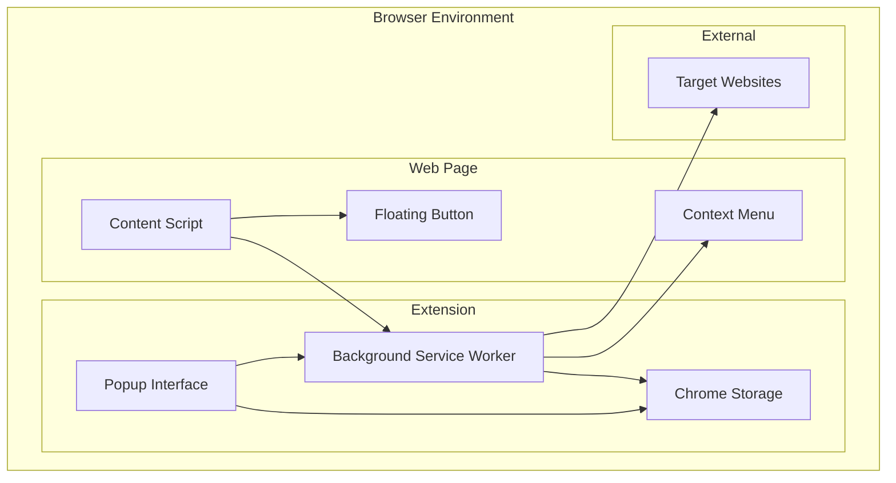
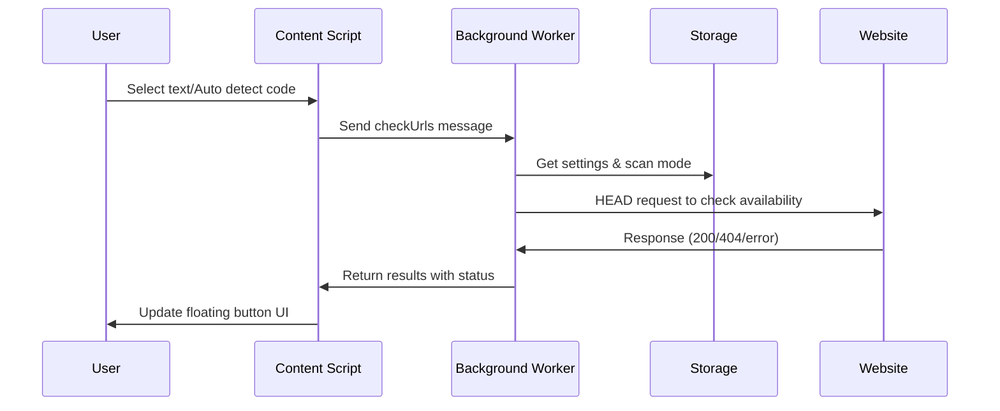

# Design Document

## Overview

QuickLinker 是一個基於 Chrome Extension Manifest V3 的瀏覽器擴充功能，採用模組化架構設計。系統由四個主要組件組成：Background Service Worker、Content Script、Popup Interface 和 Context Menu System。整體架構遵循 Chrome 擴充功能的最佳實踐，確保安全性、效能和使用者體驗。

## Architecture

### System Architecture Diagram



### Component Interaction Flow



## Components and Interfaces

### 1. Background Service Worker (background.js)

**責任範圍：**
- 管理右鍵選單的創建和更新
- 處理來自 Content Script 的 URL 檢查請求
- 管理擴充功能生命週期事件
- 協調不同組件間的通訊

**核心介面：**

```javascript
// Message Handler Interface
interface MessageHandler {
  action: 'updateContextMenu' | 'checkUrls';
  code?: string;
}

// URL Check Response Interface
interface UrlCheckResponse {
  results: Array<{
    id: string;
    url: string;
    siteName: string;
    status: 'available' | 'unavailable' | 'error' | 'loading';
    finalUrl?: string;
    error?: string;
  }>;
}

// Settings Interface
interface SiteSettings {
  id: string;
  name: string;
  versions: Array<{
    id: string;
    name: string;
    baseUrl: string;
  }>;
}
```

**關鍵功能模組：**

1. **Context Menu Manager**
   - 動態創建多層級右鍵選單
   - 監聽選單點擊事件並開啟對應 URL
   - 支援設定變更時的即時更新

2. **URL Availability Checker**
   - 使用 Fetch API 進行 HEAD 請求
   - 支援兩種掃描模式：最佳結果模式和完整掃描模式
   - 錯誤處理和超時管理

3. **Storage Event Listener**
   - 監聽 chrome.storage.sync 變更事件
   - 自動更新右鍵選單配置

### 2. Content Script (content.js)

**責任範圍：**
- 偵測網頁內容中的特定代碼格式
- 管理智慧浮動按鈕的生命週期
- 處理使用者互動（選取文字、拖曳按鈕）
- 與 Background Worker 通訊進行 URL 檢查

**核心介面：**

```javascript
// Code Detection Interface
interface CodeDetector {
  getCode(): string | null;
  extractCodeFromText(text: string): string | null;
}

// Floating Button Manager Interface
interface FloatingButtonManager {
  createFloatingButton(code: string): Promise<void>;
  updateButtonStates(results: UrlCheckResponse['results']): void;
  makeDraggable(): void;
}
```

**關鍵功能模組：**

1. **Code Detection Engine**
   - 自動偵測剪貼簿元素中的代碼
   - 從 URL 和頁面標題提取代碼（針對特定網站）
   - 正則表達式匹配 XXX-YYY 或 XXXX-YYY 格式

2. **Floating Button System**
   - 動態創建和管理浮動按鈕 UI
   - 狀態視覺化（顏色編碼和動畫效果）
   - 拖曳功能實現

3. **DOM Observer**
   - 使用 MutationObserver 監聽頁面變化
   - 自動觸發代碼偵測和按鈕創建

### 3. Popup Interface (popup.html + popup.js)

**責任範圍：**
- 提供網站和版本的 CRUD 操作介面
- 管理掃描模式設定
- 處理設定的匯入/匯出功能
- 實現拖曳排序功能

**核心介面：**

```javascript
// Settings Manager Interface
interface SettingsManager {
  loadSettingsAndRender(): Promise<void>;
  saveSettings(settings: SiteSettings[]): Promise<void>;
  exportSettings(): void;
  importSettings(file: File): Promise<void>;
}

// UI Controller Interface
interface UIController {
  renderSites(settings: SiteSettings[]): void;
  renderVersions(siteId: string, versions: Version[]): void;
  initSortable(containerId: string, callback: Function): void;
}
```

**關鍵功能模組：**

1. **Tab Management System**
   - 三個主要標籤：網站管理、掃描設定、新增網站
   - 標籤間的狀態管理和切換

2. **CRUD Operations Manager**
   - 網站和版本的增刪改查操作
   - 表單驗證和錯誤處理
   - 即時 UI 更新

3. **Drag & Drop System**
   - 自訂拖曳排序實現
   - 支援網站和版本的重新排序
   - 視覺回饋和狀態管理

### 4. Context Menu System (contextMenu.js)

**責任範圍：**
- 整合到瀏覽器原生右鍵選單
- 處理文字選取事件
- 管理多層級選單結構

## Data Models

### 1. Site Configuration Model

```javascript
interface SiteConfiguration {
  id: string;              // 唯一識別符
  name: string;            // 顯示名稱
  versions: Version[];     // 版本列表
}

interface Version {
  id: string;              // 唯一識別符
  name: string;            // 版本名稱
  baseUrl: string;         // 基礎 URL，包含 {} 佔位符
}
```

### 2. Scan Settings Model

```javascript
interface ScanSettings {
  scanMode: 'bestMatch' | 'fullScan';  // 掃描模式
}
```

### 3. URL Check Result Model

```javascript
interface UrlCheckResult {
  id: string;              // 對應的 siteId_versionId
  url: string;             // 完整的檢查 URL
  siteName: string;        // 網站和版本的組合名稱
  status: 'available' | 'unavailable' | 'error' | 'loading';
  finalUrl?: string;       // 重定向後的最終 URL
  error?: string;          // 錯誤訊息
}
```

### 4. Storage Schema

```javascript
interface StorageSchema {
  settings: SiteConfiguration[];  // 網站配置列表
  scanMode: 'bestMatch' | 'fullScan';  // 掃描模式設定
}
```

## Error Handling

### 1. Network Error Handling

**策略：**
- 使用 try-catch 包裝所有網路請求
- 設定合理的超時時間
- 提供降級處理機制

**實現：**
```javascript
async function checkUrlAvailability(url) {
  try {
    const controller = new AbortController();
    const timeoutId = setTimeout(() => controller.abort(), 5000);
    
    const response = await fetch(url, {
      method: 'HEAD',
      signal: controller.signal,
      cache: 'no-cache'
    });
    
    clearTimeout(timeoutId);
    return { status: response.status === 404 ? 'unavailable' : 'available' };
  } catch (error) {
    return { status: 'error', error: error.message };
  }
}
```

### 2. Storage Error Handling

**策略：**
- 驗證資料格式和完整性
- 提供預設值和回退機制
- 錯誤訊息的使用者友善化

### 3. UI Error Handling

**策略：**
- 表單驗證和即時回饋
- 優雅的錯誤訊息顯示
- 防止重複操作的狀態管理

## Testing Strategy

### 1. Unit Testing

**測試範圍：**
- 代碼偵測邏輯
- URL 構建和驗證
- 資料模型操作
- 設定的匯入/匯出功能

**測試工具：**
- Jest 作為測試框架
- Chrome Extension Testing Utilities

### 2. Integration Testing

**測試範圍：**
- Background Worker 和 Content Script 間的通訊
- Storage 操作的一致性
- 右鍵選單的功能完整性

### 3. End-to-End Testing

**測試範圍：**
- 完整的使用者工作流程
- 跨頁面的功能持續性
- 不同網站的相容性測試

### 4. Performance Testing

**測試重點：**
- 大量網站配置下的效能表現
- 網路請求的並發處理
- 記憶體使用量監控

## Security Considerations

### 1. Content Security Policy

**實施策略：**
- 嚴格的 CSP 設定
- 禁止 inline scripts 和 eval()
- 限制外部資源載入

### 2. Permission Management

**最小權限原則：**
- 只請求必要的 Chrome API 權限
- 明確說明權限用途
- 定期審查權限需求

### 3. Data Validation

**輸入驗證：**
- URL 格式驗證
- 防止 XSS 攻擊
- 設定檔案的完整性檢查

### 4. Network Security

**安全措施：**
- 使用 HTTPS 進行所有外部請求
- 實施請求頻率限制
- 防止 CSRF 攻擊

## Performance Optimization

### 1. Network Optimization

**策略：**
- 使用 HEAD 請求減少資料傳輸
- 實施請求快取機制
- 並發請求的合理控制

### 2. DOM Optimization

**策略：**
- 最小化 DOM 操作
- 使用 DocumentFragment 進行批量更新
- 事件委託減少監聽器數量

### 3. Memory Management

**策略：**
- 及時清理事件監聽器
- 避免記憶體洩漏
- 合理的快取策略

### 4. Storage Optimization

**策略：**
- 使用 chrome.storage.sync 進行跨裝置同步
- 實施資料壓縮
- 定期清理無效資料